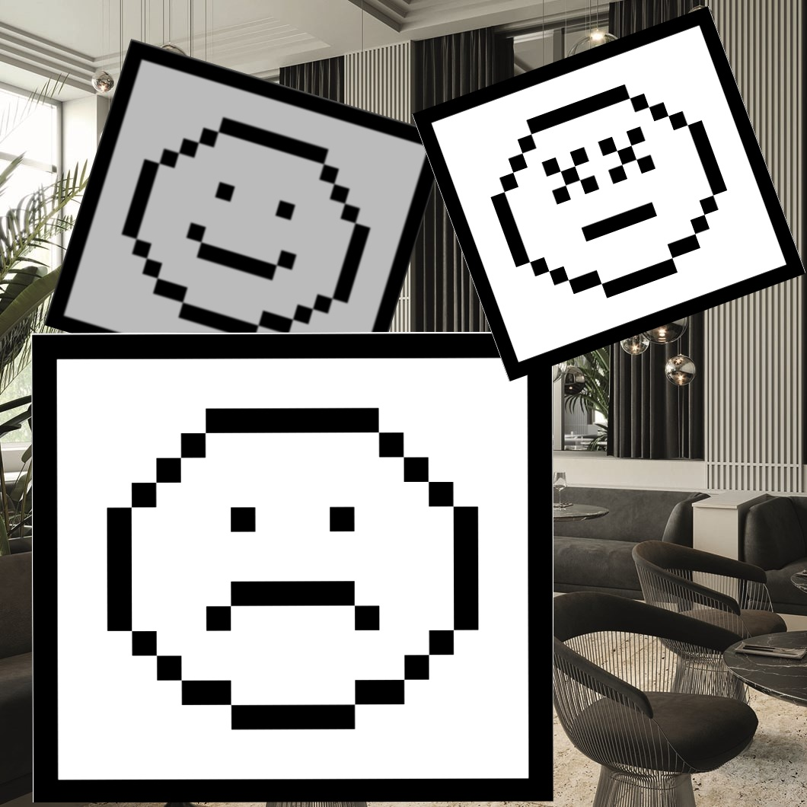

# beefreeagro

<div align="center">
  
</div>

## Linux/Mac

```bash
conda env create -f stickers_env.yml
```

Train the model:

```bash
python train.py --data_dir data/synth/imgs --annotations data/synth/annotations.txt --epochs 50 --model_size n
```

Test the model:

```bash
python test.py test-dir result-dir
```

## Windows

For GPU:

```cmd
init-gpu.bat
```

For CPU:

```cmd
init-cpu.bat
```

Training the Model:

```cmd
.\.venv\Scripts\python.exe train.py --data_dir data/synth/imgs --annotations data/synth/annotations.txt --epochs 50 --model_size n
```

Testing the Model:

```cmd
.\.venv\Scripts\python.exe test.py test-dir result-dir
```
